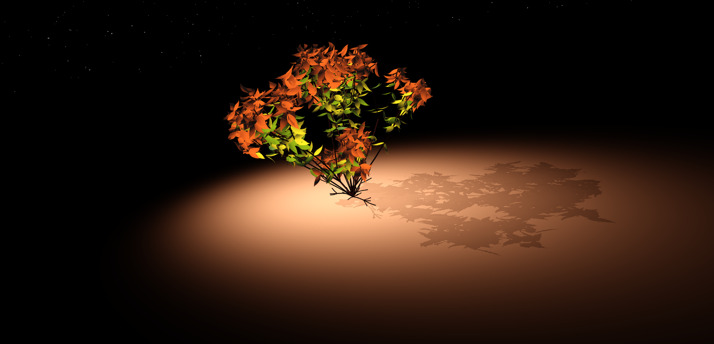
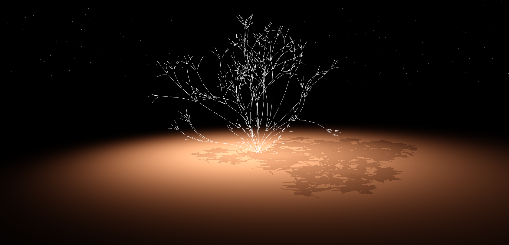
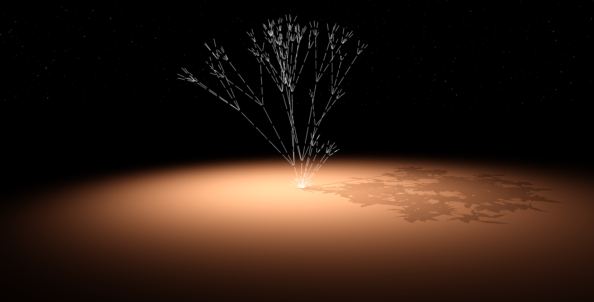
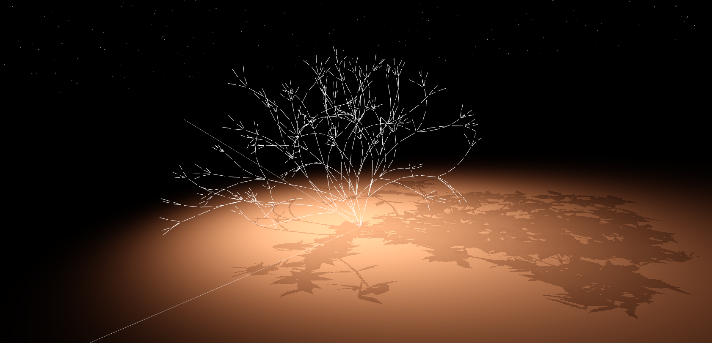
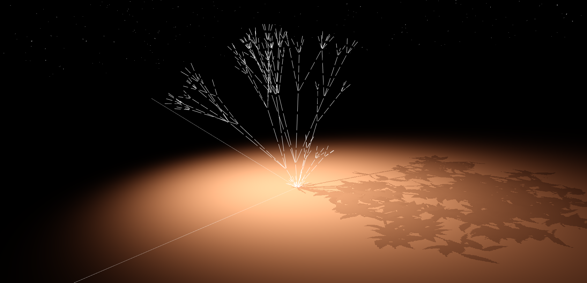

# L-systems



[Demo Link](https://vasumahesh1.github.io/LSystem_WebGL/)

I went with a more plant-like approach rather than a tree. I have a couple of interesting features built into this system. Overall I have a base LSystem that actually abstracts a lot of the details from the LSystem Instance Class that I use to create my tree.

Some of the features include (overall), some will be pretty obvious:

- **Weighted Rules in a combined RuleSet**

- **String Jumping**: Changing the iteration of the main Loop executing the constructed string in between. Allows us to go back in past or in future of the string.

- **Root String Access**: Useful for scanning for "how far" you are in the Depth.
  I used this technique also to define a depth limit till which I have random colored leaf and beyond that, the red leaves take control. Since LSystem depth varies based on recursion.

- **Abstracted Elements** from the instance class - We just worry about rules and not how the turtle is being managed, or string is generated, I think by doing this I seprated the actual drawing from the core methodology.

- **Scoping** - There are two scopes one from the base class and one from the application (main.ts). The main.ts sends stuff like Meshes (eg: `MeshInstanced`) to the LSystem Instance Class. I just use a fancy `function.apply` that keeps things a little clean. By scoping I mean you can do stuff like:

```js
function drawBranchSegment() {
  let meshInstance = this.scope.instanceMap["branch"]; // From Main Code
  let turtlePos = this.turtle.position; // From LSystem Base Class
  let depthFactor = this.depth * 0.45; // From LSystem Base Class
}

// Instead of this long chained function just for 1 Rule execution function
function drawBranchSegment(instanceMap, depth, turtle, maxDepth, itr, rootString, constraints, colors... -_- ) {}
```

- **Gravity influence** - Influence the branches based on gravity. This is achieved by rotating the turtle.heading towards the ground. The more the depth, the more the gravity effect. You can control the gravity in the controls.

- **Sunlight influence** - Tree grows towards the sunlight. Similar to gravity approach, but branches bend towards the Sunlight. Also, available via controls.

- **Collision detection for Branches** - if you open the Console, you will see an error log showing how many branches were dropped due to collisions. My approach is listed below in more detail.

- **OpenGL Instancing** - First time implementing instancing. Now, I can run around 2000 leaves and 1500 branches on my mac and still get ~50fps. I guess the number can be bigger for other systems.

- Shadow Mapping, Tonemap

In the code you can see an `LSystem1.ts -> LSystem.ts` inheritance. The base class is the one that provides the traversing and generic functions, the LSystem1 (bad name I know!) Does all the drawing.


### LSystem Components

```js
// LSystem1.ts
// The Instance Class of the base LSystem

this.system = new LSystem(seed);
this.system.setAxiom("[F][/-F][*+F][++*F][--*F]");

// Symbol Name, Production, Weight
this.system.addWeightedRule("F", "BS++[/lBFS][*BFS]++[/BFS][*lBFS]", 5);
this.system.addWeightedRule("F", "BS++[/lBFS][*BFS]++[/BFS]", 7);
this.system.addWeightedRule("F", "BS++[/BFS][*BFS]", 4);
this.system.addRule("B", "SD[l+++l+++l]SD");

// Symbol Name, Activation Function, Extra Arguments if needed
this.system.addSymbol("l", drawBranchLeaf, []);
this.system.addSymbol("D", drawBranchSegment, []);
this.system.addSymbol("S", natureTick, []);
this.system.addSymbol("-", rotateTurtleCCW, [seed * 13]);
this.system.addSymbol("+", rotateTurtleCW, [seed * 17]);
this.system.addSymbol("/", rotateTiltCW, [seed * 5]);
this.system.addSymbol("*", rotateTiltCCW, [seed * 3]);
```

#### Symbol Meanings

- `B` - A Branch
- `l` - Draw a leaf
- `D` - Draw a branch segment. Each branch is divided into Two Segments as per the `Rule B` above
- `S` - Affect the Turtle by Nature. Gravity and Light affect the turtle here
- `- + * /` - Rotation to swirl or tilt around the branch


### Gravity Influence

To achieve this, I found a plane betweem gravity direction and the turtle heading. After that I just rotated it slightly and since I do this **per** branch segment, that means even a single branch will bend nicely, so I kind of get curved branches using this, which looks nice.

The images below are using a dotted line structure to show branch-flow. I used the same to debug my collisions for branches.

| Gravity at 10.0 | No Gravity |
| ---- | ---- |
|  |  |

### Sunlight

Same effect. Sun at (15, 15, 15). Coordinate Axes shown for reference.

| Sunlight as 2.0 | Sunlight as 0.0 |
| ---- | ---- |
|  |  |

A combined effect.


### Collision Detection

I used a KD Tree from [NPM](https://www.npmjs.com/package/k-d-tree). There was an issue finding a good kdtree since I needed it to be context aware, i.e. store branch id in the tree with the coordinates. Using that I fetch about 30-40 neighbors and test them for collision. I used Segment-Segment Intersection (referenced from [here](http://geomalgorithms.com/a07-_distance.html#dist3D_Segment_to_Segment)). Essentially the algorithm finds two points on the lines and calculates the distance between them. I check this distance with a scalar like 0.015 and decide wether to place the branch at the requested point or not.

You can play with the minDistance control variable and increase it to see how fewer branches are rendered as you increase. There is a toggle to make the branches into white lines and to turn off leaves rendering, So you can toggle between 3D branches and 3D lines.

You can also turn off collision checking altogether and see the effect. I have a few images listed below.

Same Camera, Same Productions, Only the Collision is Toggled. Note: It may seem to you that they collide but might be cause the image is 2D and branches are dark brown. Also, they *generally* don't collide (more below).

| Collision Check ON | Collision Check OFF |
| ---- | ---- |
|  |  |


Collision Checking is accurate but not fully accurate. Because:

- I treat branches as lines, depending on collision distance, branches can touch each other. But won't cross.
- There is a start offset and an end offset for each Branch (hence the dotted view) if a branch comes in between that gap, it may fail. But we can always lower the offset. Currently a branch line starts from 0.05 till 0.95 (if the length is 1). So, there is a gap of 0.1 there.

Branch collisions can also be used artistically, we can set the min distance for collisions really high and get sparsely separated branches.


### Notes

If you have the error "max uniforms exceeded". Thats because I am instancing the branches and leaves and using the uniform mat4 array as an array of model matrices and using glInstanceID. If you encounter this error, then just change the MAX Uniforms in the `leaf` and `custom` shader files to something lower than 200. Also, you ll need to change the `CHUNK_SIZE` variable in `MeshInstanced.ts` so that it draws X (new number) per chunk per draw call.

### References & Libraries

- [Segment Segment Intersection](http://geomalgorithms.com/a07-_distance.html#dist3D_Segment_to_Segment)
- [KD Tree](https://www.npmjs.com/package/k-d-tree)
- [noisejs](https://www.npmjs.com/package/noisejs)
- [WebGL OBJ Loader](https://www.npmjs.com/package/webgl-obj-loader)
- Class Slides